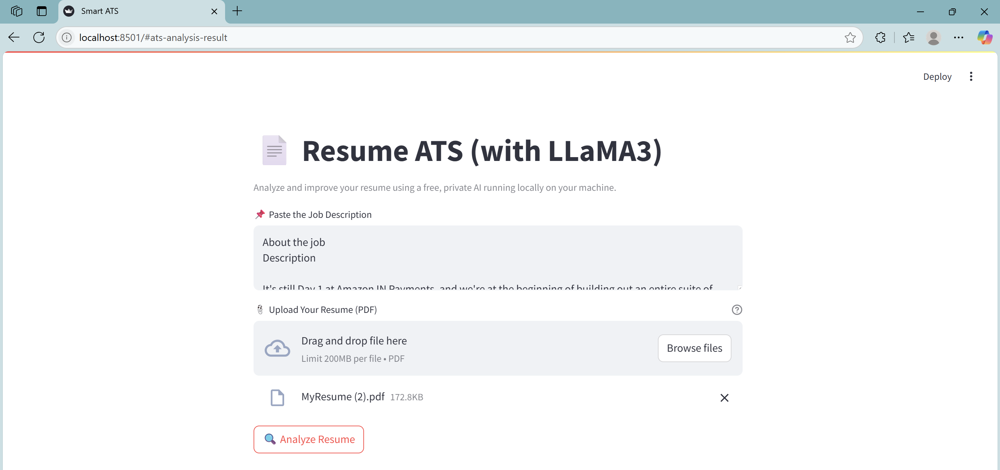
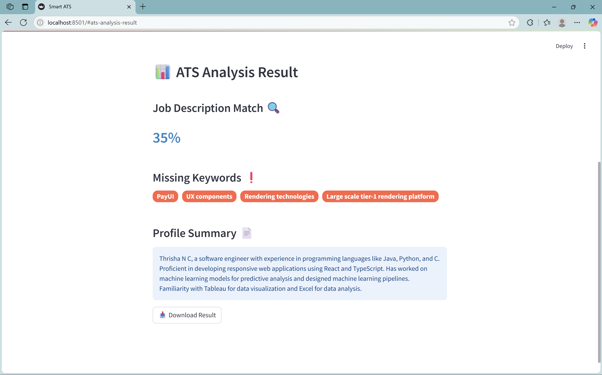

# 💼 Smart Resume ATS (Local & Free with LLaMA3)

> A privacy-first resume analysis tool powered by a local LLM (LLaMA3) and built with Streamlit.

---

## 🚀 Features

### ✅ Local AI-Powered Evaluation (via Ollama)
Harness the power of **Meta's LLaMA 3** large language model locally using [**Ollama**](https://ollama.com/), an open-source tool that lets you run powerful LLMs on your own machine. No internet connection required. Your data never leaves your system – ensuring **maximum privacy** and **zero cost**.

### 📄 Resume Parsing from PDF
Upload your resume in `.pdf` format and the app automatically extracts its text using **PyPDF2**. This enables automated content extraction for analysis without requiring you to copy and paste.

### 🔍 Job Description Matching Percentage
The app uses the local LLM to deeply compare your resume against a provided **Job Description**, evaluating how well your profile matches it. It assigns a **percentage match** to help you gauge how aligned your resume is with the JD.

### ❗ Missing Keywords Detection
Detects and lists **important keywords missing** from your resume based on the JD – helping you identify skills, tools, or terminology you may need to add to improve your chances with ATS systems or recruiters.

### 📄 Profile Summary Generation
Generates a concise and insightful **Profile Summary** that you can directly use or adapt for your resume or LinkedIn profile. This summary is personalized based on your resume content and the job you’re targeting.

### 🧠 100% Offline – No External APIs or Data Leaks
Unlike cloud-based tools like OpenAI or Google Gemini, this app runs **fully offline**. It uses Ollama and LLaMA 3 locally, meaning:
- 💸 **No API costs**
- 🔒 **No risk of data sharing**
- 🧠 **Full control of your resume and job data**

---

With this tool, you're using **cutting-edge local AI** to gain a competitive edge in job applications – all while preserving your privacy and saving money!


## 📸 Preview



After launching the app, you’ll see a simple interface:
- 📌 **Paste the Job Description** into the text area.
- 📎 **Upload your resume** (PDF format only).
- Click **🔍 Analyze Resume** to evaluate your resume against the job description.

The app runs fully locally using LLaMA3 via Ollama and processes the input in real-time.

---

## 🛠️ Tech Stack

- 🐍 Python 3.10+
- 🦙 [Ollama](https://ollama.com/) + LLaMA3
- 📚 PyPDF2
- 🌐 Streamlit

---

## 🧾 Sample Output



Once analyzed, the tool will show:
- 🔍 **Job Description Match** – how well your resume aligns with the job description (in %).
- ❗ **Missing Keywords** – important terms or skills missing in your resume that appear in the job description.
- 📄 **Profile Summary** – a short AI-generated overview of your profile strengths and gaps.

You can also expand/collapse sections and **download the analysis as a `.json`** file.

---

## 🧪 How to Run Locally

### 1. Clone the repository
```bash
git clone https://github.com/Thrishanc/Resume-ATS.git
cd Resume-ATS
```

### 2. Create and activate a virtual environment
```bash
python -m venv venv
venv\Scripts\activate  # On Windows
source venv/bin/activate  # On macOS/Linux
```

### 3. Install dependencies
```bash
pip install -r requirements.txt
```

### 4. Install and run LLaMA3 locally with Ollama
```bash
# Download the model (one time)
ollama run llama3
```

### 5. Run the Streamlit app
```bash
streamlit run app.py
```

---

## 📂 Project Structure

```
Resume-ATS/
├── app.py                # Main Streamlit app
├── requirements.txt      # Python dependencies
├── .gitignore
└── README.md             # You're here!
```

---

## 📄 License

This project is licensed under the [MIT License](LICENSE).

---

## 🙋‍♂️ Author

Made with ❤️ by [Thrishanc](https://github.com/Thrishanc)

---

> If you like this project, please ⭐ star the repo and feel free to contribute or fork it!
